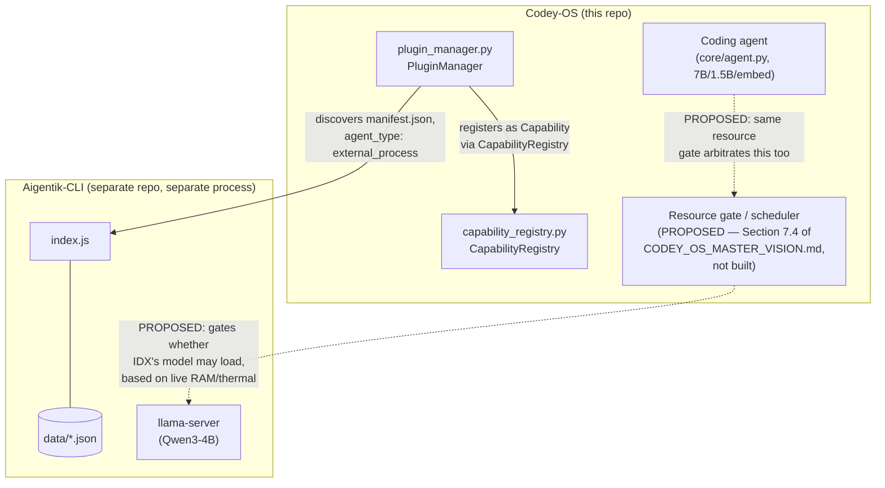

> [← Back to README](../README.md)

# Agent/Plugin Integration Blueprint

**Status: design document for the multi-agent platform direction
(`CODEY_OS_MASTER_VISION.md` Section 9, confirmed by Ish 2026-08-05).
Nothing described here as "proposed" or "future" is implemented yet.**
Everything marked "today" is verified against the actual code in
`ccos/core/capability_registry.py` and `ccos/core/plugin_manager.py` as
of this writing — cited by real class/function name, not invented ones.
This document does not change any running code; it exists so future
plugin/agent work (Codey-OS's own future domain agents, and any
integration of a genuinely separate project like Aigentik-CLI) has one
place to build toward.

---

## 1. Why this document exists

`CODEY_OS_MASTER_VISION.md` Section 1 already described CCOS as a shell
"built to register, run, monitor, and eventually extend capabilities
beyond coding." Section 9 (2026-08-05) makes explicit what that means in
practice: Codey-OS is a multi-agent platform, and future domain agents
may look nothing like today's plugins — they may be a separate process,
running their own model, with their own event loop and their own data
store, rather than an in-process Python module imported via `importlib`.
Today's plugin system (Section 2 below) was built for the latter shape.
This document is the bridge: what a plugin/agent must declare, how it
registers with the substrate that exists today, and what changes once
the not-yet-built scheduler/resource-bus exists.

---

## 2. What exists today (verified, not aspirational)

### 2.1 `CapabilityRegistry` (`ccos/core/capability_registry.py`)

The central inventory. A `Capability` is a dataclass with: `name`,
`description`, `implementation` (a `"module:function"` string or a path),
`category`, `dependencies`, `hardware_requirements` (a plain list of
strings, matched by exact membership — see `query()`'s `hardware_hints`
filter), `test_path`, `status` (`ACTIVE`/`EXPERIMENTAL`/`BROKEN`/
`DISABLED`), `version`, and running-average performance fields
(`use_count`, `success_count`, `failure_count`, `avg_duration_ms`,
`success_rate`). `CapabilityRegistry.register()`/`unregister()`/`get()`/
`has()`/`query()`/`find_for_task()` (keyword-overlap scoring) /
`record_use()` are the real API surface. Persisted as JSON to
`ccos/data/capabilities.json`. Accessed via the module-level singleton
`get_capability_registry()`.

**What it does NOT have today:** any concept of model size, resource
footprint, or which process/agent owns a capability beyond the
free-text `implementation` field. `hardware_requirements` is the only
existing field even adjacent to a resource declaration, and it's an
unstructured string list (e.g. used today for things like `"camera"`),
not a model-tier or RAM-footprint schema.

### 2.2 `PluginManager` (`ccos/core/plugin_manager.py`)

Discovers plugins on disk under `ccos/plugins/<category>/<name>/`,
each with a `manifest.json` and an entry-point Python file (default
`__init__.py`, overridable via the manifest's `entry_point`).
`_discover()` scans and builds `Plugin` records (name, path, manifest
dict, version) without importing anything yet. `load(name)` does the
actual work: `importlib.util.spec_from_file_location` +
`exec_module` to import the entry-point module into the running
process, then builds a `Capability` for each entry in the manifest's
`capabilities` list and calls `CapabilityRegistry.register()` on it.
`call_capability(cap_name, *args, **kwargs)` looks up which loaded
plugin owns a capability name and calls the corresponding function on
the already-imported module, timing the call and recording success/
failure back to the registry via `record_use()`. `load_all()` loads
every discovered plugin. Singleton accessor: `get_plugin_manager()`.

**What it does NOT have today:** any loading path other than
`importlib`-based in-process Python import. There is no concept of
"start this as a subprocess and talk to it over a socket/HTTP," which
is what a genuinely separate agent process (Section 4's Aigentik-CLI
example) would need.

### 2.3 A real manifest, for reference (`ccos/plugins/system/thermal_monitor/manifest.json`)

```json
{
  "name": "thermal_monitor",
  "version": "1.0.0",
  "description": "...",
  "category": "system",
  "entry_point": "thermal_monitor.py",
  "capabilities": [
    {
      "name": "system.monitor_snapshot",
      "description": "...",
      "implementation": "thermal_monitor:monitor_snapshot",
      "category": "system",
      "dependencies": [],
      "hardware_requirements": []
    }
  ],
  "author": "CCOS",
  "license": "MIT"
}
```

This is the real, current shape every plugin in `ccos/plugins/` follows.
Section 3 proposes extending it, additively, for agents that need more
than this schema currently expresses.

---

## 3. Proposed manifest extensions (NOT implemented — design only)

For an agent (as opposed to today's simple tool-plugins) to integrate
cleanly, its manifest needs to declare more than `capabilities`. None of
the fields below are read by `plugin_manager.py` today; they are a
proposed, additive schema for the eventual agent-registration path.

| Field | Purpose | Notes |
|---|---|---|
| `agent_type` | `"in_process"` (today's only real shape — an importable Python module) vs. `"external_process"` (a separately-started process talked to over some IPC boundary — e.g. Aigentik-CLI's Node.js process and HTTP-fronted `llama-server`) | Distinguishes what `plugin_manager` (or its eventual successor) needs to do to "load" this agent — `importlib` vs. process supervision |
| `model_tiers` | Per-role model declarations, e.g. `{"primary": {"family": "qwen3", "size": "4B", "quant": "Q4_K_M"}}` | Extends `CODEY_OS_MASTER_VISION.md` Section 7.3's `(domain, role, tier)` concept beyond the coding domain; explicitly NOT assuming every agent needs the shared 7B |
| `resource_footprint` | Declared RAM (MB) and whether the agent's model, once loaded, needs to stay resident or can be loaded/unloaded on demand | Input to the future resource gate (Section 5 below); today nothing computes or checks this |
| `event_triggers` | What causes this agent to do work — e.g. `"imap_idle"`, `"schedule"`, `"http_request"`, `"task_queue"` | Lets a future scheduler know whether an agent is push-driven (like Aigentik-CLI's IMAP IDLE) or pull-driven (like today's daemon task queue) — these need different resource-gating logic, since a push-driven agent can't simply "wait its turn" without losing events |
| `permissions` | What the agent may touch — filesystem paths, network egress, whether it can send real-world side effects (e.g. send an email) without confirmation | Generalizes the existing sandbox/safety-veto governance model (`CODEY_OS_MASTER_VISION.md` Section 4) to agents that aren't Codey-OS's own coding agent |
| `data_store` | Where the agent's own persistent state lives, and a statement that it is NOT shared with `ccos_memory` or any other agent's store by default | Matches Section 4's non-goal of a general shared-memory grant — see `CODEY_OS_MASTER_VISION.md` Section 6 |

---

## 4. Worked example: Aigentik-CLI

Aigentik-CLI (`~/Aigentik-CLI`, a separate git repo — not part of this
one) is used here as the concrete "what would integrating an existing
agent actually require" example, per Ish's 2026-08-05 request. This
section describes what integration would require; it does not implement
it. Actual integration work is a separate, not-yet-scoped follow-up (see
`WORK_QUEUE.md`).

### 4.1 What it actually is today (verified from its own `README.md`/`CLAUDE.md`/`docs/architecture.md`)

- A standalone Node.js process (`index.js`), NOT Python — a real
  language/runtime boundary from Codey-OS's `core/`/`ccos/`.
- Runs its own `llama-server` instance serving Qwen3-4B on
  `127.0.0.1:8080`, started/stopped by its own `start.sh`/`stop.sh` — a
  second, independent local-model process from whatever Codey-OS's
  primary/planner/embedding models are.
- Event-driven via Gmail IMAP IDLE (push, not polled) plus Google Voice
  SMS arriving as forwarded email.
- Its own JSON-file data store under `data/` (contacts, calendar, review
  queue, rules, profile) — gitignored, per-install, not shared with
  anything.
- A natural-language owner-command interface routed through
  `owner-command.js` + `llama.js`'s `interpretCommand`.

### 4.2 What integration would concretely require

1. **`agent_type: "external_process"`** — Aigentik-CLI cannot be loaded
   via `importlib.util.spec_from_file_location` the way every current
   CCOS plugin is; it is a separate Node.js process. Its "load" step
   would mean supervising `start.sh`/`stop.sh` (or a Python-native
   equivalent) rather than importing a module.
2. **`resource_footprint`** declaring Qwen3-4B's RAM footprint, so the
   future resource gate (Section 9.2 of the vision doc) knows this
   agent's model load competes with Codey-OS's own 7B/1.5B/embedding
   stack for the same device RAM — this is a real collision risk today
   if both were run simultaneously with no arbitration, exactly the
   kind of case CLAUDE.md rule 2's RAM discipline exists for.
3. **`event_triggers: ["imap_idle"]`** — Aigentik-CLI is push-driven; it
   cannot simply queue and wait for a turn the way a pull-driven task in
   Codey-OS's daemon task queue can, without risking a missed/late
   IMAP-triggered event. A future scheduler would need to treat
   push-driven agents differently from pull-driven ones — this is an
   open design question, not answered here.
4. **`permissions`** would need to state that this agent can send real
   email/SMS replies (a real-world side effect) — a strictly stronger
   permission class than anything today's CCOS plugins currently
   exercise, and squarely inside the governance model
   `CODEY_OS_MASTER_VISION.md` Section 4 already describes (sandbox-
   first execution, explicit consent for anything leaving the device).
5. **`data_store`** pointing at Aigentik-CLI's own `data/` directory,
   explicitly declared as NOT shared with `ccos_memory` or the coding
   agent's five-tier memory, consistent with
   `CODEY_OS_MASTER_VISION.md` Section 6's non-goal of a general
   shared-memory grant.
6. **No code changes to Aigentik-CLI's own architecture would be
   required to make it registrable in principle** — its `README.md`
   already documents its data/process/model boundaries as clean and
   self-contained. What's missing entirely is the Codey-OS-side
   plumbing described in Sections 3 and 5 of this document (the
   manifest fields, the process-supervision path in a future
   `PluginManager`, and the resource gate) — none of which exists yet.

### 4.3 Diagram — Aigentik-CLI as a registered external-process agent (proposed, not built)



---

## 5. Interaction with the future scheduler/resource-bus

**Not built yet.** `CODEY_OS_MASTER_VISION.md` Section 7.4 already
specifies a single resource-gate authority (composing `device_manager`'s
hardware inventory with live `sysmon`/`thermal`/`observability` signals,
expressed as headroom-minus-margin rather than a hardcoded number) as the
sole authority for load/unload/keep-resident decisions, starting with
the coding domain's own daemon. Section 9.2 of the vision doc's
2026-08-05 amendment states the direction this must eventually
generalize toward: arbitrating across multiple agent processes, some of
which (like Aigentik-CLI) are not Codey-OS subprocesses at all. This
document does not design that generalization — it only records the
manifest fields (Section 3's `resource_footprint`, `event_triggers`)
that a future resource gate would need an agent to declare in order to
reason about it. Building the resource gate itself is tracked as its
own item in `WORK_QUEUE.md`, sequenced per `CODEY_OS_MASTER_VISION.md`
Section 7.6's existing rollout order (resource gate first, coding-domain-
only, before any cross-agent generalization).

---

## 6. Summary — what's real vs. proposed

| Piece | Status |
|---|---|
| `CapabilityRegistry`, `PluginManager`, current manifest schema (Section 2) | **Real, implemented, verified by direct code read.** |
| `agent_type`, `model_tiers`, `resource_footprint`, `event_triggers`, `permissions`, `data_store` manifest fields (Section 3) | **Proposed. Not read by any code today.** |
| Resource gate / scheduler (Section 5) | **Not built.** Design intent recorded in `CODEY_OS_MASTER_VISION.md` Section 7.4 (coding-domain, in-process) and Section 9.2 (multi-agent generalization, not designed). |
| Aigentik-CLI integration (Section 4) | **Not started.** This section is a worked example of requirements, not an implementation plan. Actual integration scoping is a separate follow-up item — see `WORK_QUEUE.md`. |

---

[← Back to README](../README.md)
